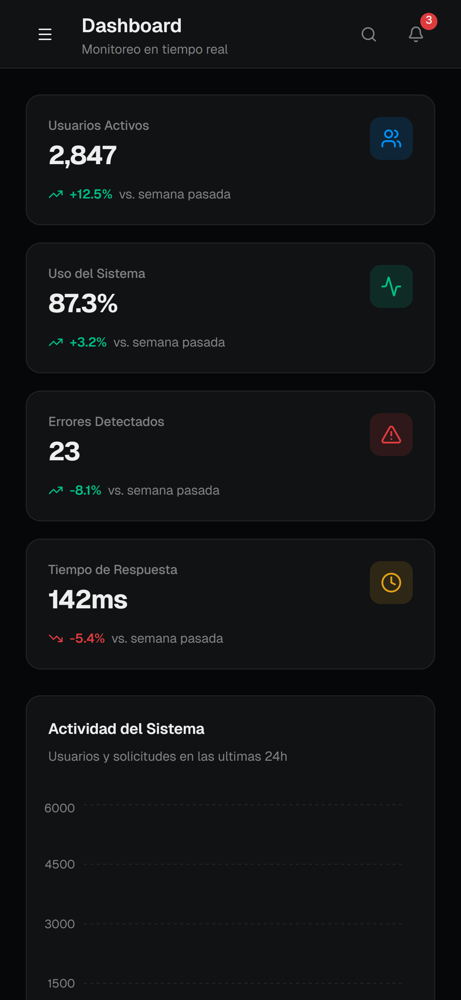

# DEMO — University Platform Monitoring (UniMonitor)

A **demo** web application for **real-time monitoring** of a university platform. It showcases a monitoring dashboard with **KPIs**, **charts**, and a **recent events log**, plus placeholder sections for monitoring, analytics, users, database, alerts, and settings.

**Live demo:** https://demomonitorizacion.vercel.app/

> Disclaimer: This repository is **DEMO-only**. It does **not** provide real monitoring or production integrations yet. Most screens are powered by **mocked data** for UI/UX demonstration purposes.

---

## Key Features

- **Main dashboard (KPIs):** active users, system usage, detected errors, response time.
- **Data visualization:**
  - Activity over time chart.
  - Module usage chart (usage vs errors).
- **Recent events feed** (error / warning / info).
- **Module navigation (demo sections):**
  - Monitoring
  - Analytics
  - Users
  - Database
  - Alerts
  - Settings
- **Modern, accessible UI** (Radix UI style components).
- **Analytics included** (Vercel Analytics).

---

## Tech Stack

- **Next.js** (App Router)
- **React**
- **TypeScript**
- **Tailwind CSS** (PostCSS)
- **Radix UI** (components)
- **Recharts** (charts)
- **Vercel Analytics**

---

## Requirements

- **Node.js** (recommended: a recent LTS version)
- npm / pnpm / yarn (use your preferred package manager)

---

## Getting Started (Local)

1. Clone the repository:
   ```bash
   git clone https://github.com/Kelvin-Palma/DEMO---Monitorizacion.git
   cd DEMO---Monitorizacion
   ```

2. Install dependencies:
   ```bash
   npm install
   ```

3. Run the development server:
   ```bash
   npm run dev
   ```

4. Open the app:
   - Default: `http://localhost:3000`

---

## Project Structure (Overview)

- `app/` — Routes and layouts (Next.js App Router)
  - `app/layout.tsx` — root layout and metadata
  - `app/(dashboard)/` — dashboard route group
    - `page.tsx` — main dashboard (KPIs, charts, events)
    - subroutes: `monitoreo/`, `analiticas/`, `usuarios/`, `base-de-datos/`, `alertas/`, `configuracion/`
- `components/` — Reusable UI + dashboard components
- `lib/` — Utilities and data
  - `lib/mock-data.ts` — mock data for KPIs, charts, events, and navigation
- `public/` — Static assets
- `styles/` — Additional styles (if applicable)

---

## Mock Data

This demo uses mocked data to render the dashboard and charts, including:

- KPI cards
- Activity timeline data
- Module usage data (e.g., Enrollment, Grades, Payments, etc.)
- Recent system events (error/warning/info)
- Sidebar navigation items

You can find it in: `lib/mock-data.ts`.

---

## Screenshots


### Mobile
<p align="center">
  
</p>

## Roadmap (Ideas)

- Replace mock data with real APIs
- Authentication and roles (admin/support/viewer)
- Configurable alert rules (thresholds, severity, channels)
- Export reports (CSV/PDF)
- Observability tooling (metrics/logs/traces — e.g., OpenTelemetry)

---

## Contributing

1. Fork the repo
2. Create a branch: `git checkout -b feature/my-improvement`
3. Commit changes: `git commit -m "Add X"`
4. Push: `git push origin feature/my-improvement`
5. Open a Pull Request

---
